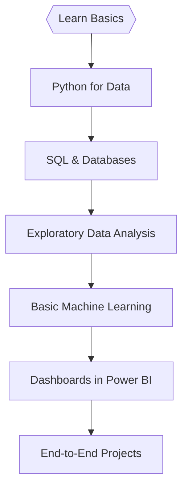

## Hi there 👋<!-- 🚀 Modern Animated Header | Data Science Learner -->

  

<h1 align="center">Hi, I'm Shubham Singh Shekhawat! 👋</h1>

  <b>🚀 Data Science</b> &nbsp;|&nbsp; <b>📈 Aspiring Data Analyst</b> &nbsp;|&nbsp; <b>🧠 Python & Power BI</b>

---

## 🧬 My Tech Story: Automating + Innovating Across Stacks

- **Data Science Mindset**: I love turning raw, messy data into insights using Python, Pandas, NumPy, and ML models.
- **ML Explorer**: Always experimenting with algorithms — classification, clustering, forecasting — and learning how to improve real-world predictions.
- **Analytical Thinking**: I break down complex problems into simple, logical, and workable solutions.
- **Curiosity Driven**: If data exists, I want to analyze it. If patterns exist, I want to find them.

---

## 💡 Toolbox of the Modern Era

 
  <!-- DevOps --> 
       
  <!-- Data Science --> 
       
  <!-- Others -->    

---

  <!-- GitHub Stats (Updated URL) -->
  
  <!-- GitHub Streak (Updated URL) -->
  
   
  <!-- Profile Summary -->
  

---

## 📡 Connect With Me

  
  

---

## 🌈 Final Thought

> Pipelines are like puzzles; ML is like magic.  
> Every new tool is a party, and every new problem is an invitation.  
> Trying to make tech more fun, fast, and fail-proof—one commit at a time.

---

  
   
  <i>Modern Analyst + DataScience by Shubham Singh Shekhawat</i>

<!--
**shub8627/Shub8627** is a ✨ _special_ ✨ repository because its `README.md` (this file) appears on your GitHub profile.

Here are some ideas to get you started:

- 🔭 I’m currently working on ...
- 🌱 I’m currently learning ...
- 👯 I’m looking to collaborate on ...
- 🤔 I’m looking for help with ...
- 💬 Ask me about ...
- 📫 How to reach me: ...
- 😄 Pronouns: ...
- ⚡ Fun fact: ...
-->
